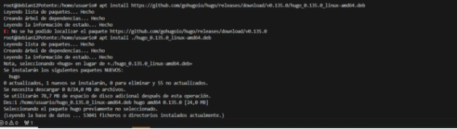
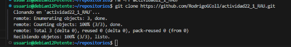
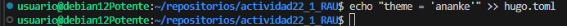
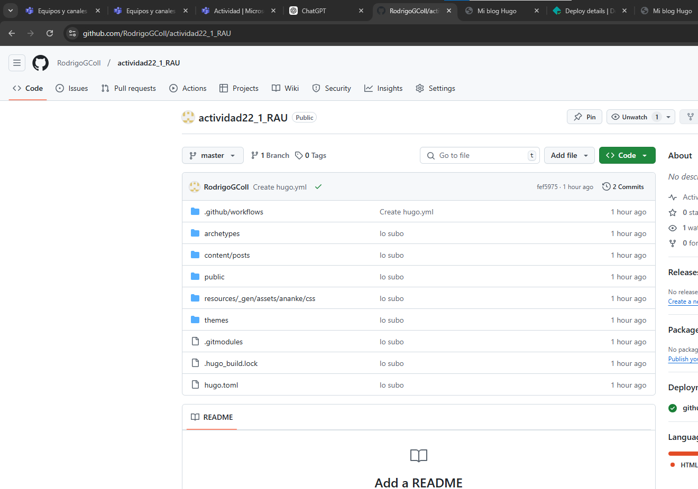
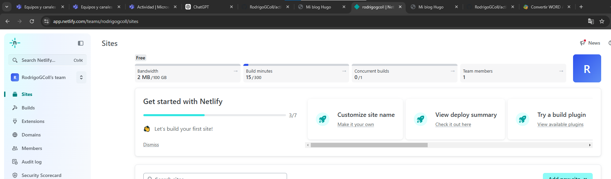
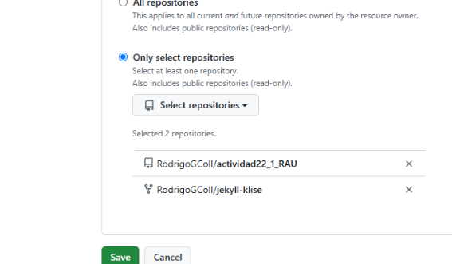
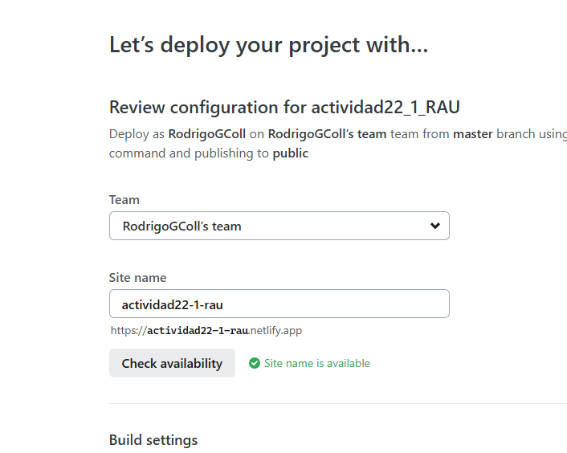
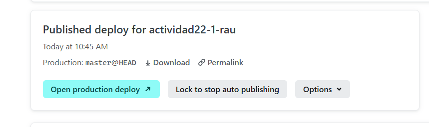

# Instalación y Configuración de Hugo
 
Voy a crear una página en Hugo mediante visual studio code y voy a desplegarla mediante comandos en Github y Netlify.
 
---
 
## 1. Instalación de Hugo
   - Instalo la versión extendida de Hugo mediante el comando mostrado.
 
   
 
---
 
## 2. Creación de un nuevo proyecto en Hugo
   - Utilizo el comando:
     ```bash
     hugo new site <actividad22_2_RAU>
     ```
   - Esto generará la estructura inicial del proyecto.
 
   
 
## 3. Configuración del repositorio en GitHub
   - Me meto a GitHub y creo un nuevo repositorio vacío con el nombre de la actividad.
 
   
 
1. **Clonar el repositorio**:
   - Para clonar este repositorio utilizo este comando
     ```bash
     git clone https://github.com/RodrigoGColl/actividad22_1_RAU.git
     ```
 
   
 
---
 
## 4. Gestión de temas en Hugo
 
1. **Añado un tema al proyecto**:
   - Descargo el tema ananke y lo añado como submódulo:
     ```bash
     git submodule add <URL del tea de ananke> themes/<ananke>
     ```
 
   
 
2. **Configuración del tema**:
   - Añado la referencia al tema en el archivo de configuración:
     ```bash
     theme = "<ananke>"
     ```
 
   
 
3. **Actualización del submódulo**:
   - Para la actualización del módulo ejecuto:
     ```bash
     git submodule init
     git submodule update
     ```
 
   
 
---
4. **Configuración del índice**

   - Así he configurado el índice de la página
   
   

## 5. Subida del proyecto a GitHub
 
1. **Preparar los cambios para subirlos**:
   - Añado los archivos:
     ```bash
     git add .
     ```
   - Confirmo los cambios:
     ```bash
     git commit -m "lo subo"
     ```
   - Subo los cambios al repositorio:
     ```bash
     git push -u origin master
     ```
 
   
   
---
 
## 6. Despliegue en Netlify
 
1. **Vinculación del repositorio en Netlify**:
   - Accedo a Netlify, creo un nuevo sitio desde un repositorio y selecciono el proyecto que he hecho.
 
   
 
2. **Configurar el dominio y desplegar el sitio**:
   - Ajusto las configuraciones necesarias para el dominio y el despliegue, seguiré los siguientes pasos.
 
   
   
   
   

   - Aquí ya se ha completado
  
   
---