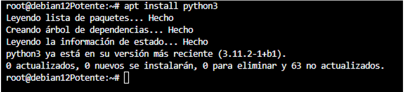
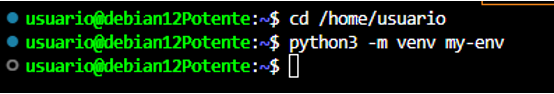
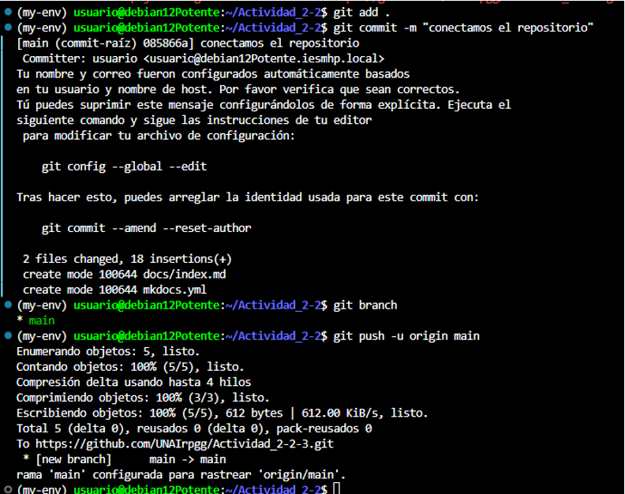

## Instalacion de mkdocs

Buscamos los paquetes realizando una actualización.

Instalación de git.

Instalación de python y pip.

Instalación módulo gestor de entornos virtuales

Creación de un nuevo entorno virtual de Python.

Instalación de mkdocs.

Creamos el directorio donde vamos a trabajar.

Subimos el repositorio a GitHub.

Instalamos los diferentes temas para la página web.